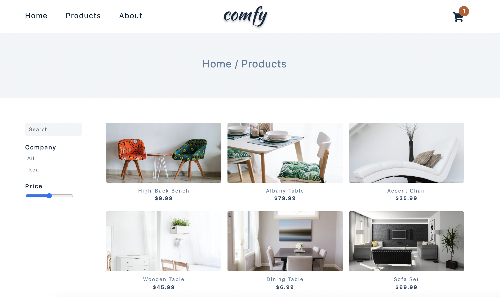
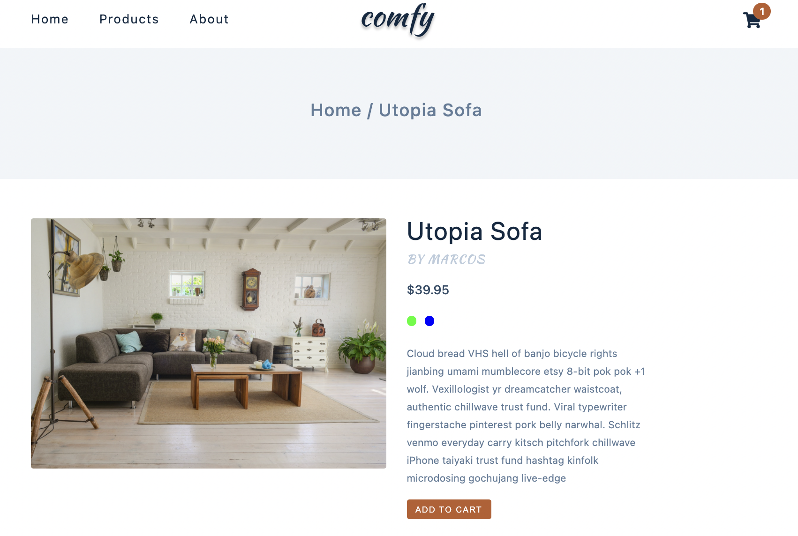

## Vanilla JS project - Comfy Store

[Part of John Smilga's JS Tutorial](https://www.udemy.com/course/javascript-tutorial-for-beginners-w/learn/lecture/21671372?start=1#overview)

- See the project on Netlify
- Navbar with logo and links, that navigate to separate pages. Shopping cart.
- On the home page we have:
  hero with link to the products;
  section with featured products. When we hover over a featured product, we have link to a product page or we can add the product to the cart
- Working with LocaleStorage. Save all fetched products in the local storage so we can use them in different modules
- Using Intl.NumberFormat() to format the prices
- Product page: image and info about the product as well as option to add the product to the cart. When we click on a certain product, we take its id, include it in the product url and use it to fetch detailed info about the product.
- All products page: filter products based on company or price; search form for searching for a product by name
- Simple about page
- Shoping cart: Once product is in the cart we can change amount or remove it from the cart.
- Dynamically change the title of every page
- Responsive CSS design: On a small screen we have a sidebar

    

 

    

    

